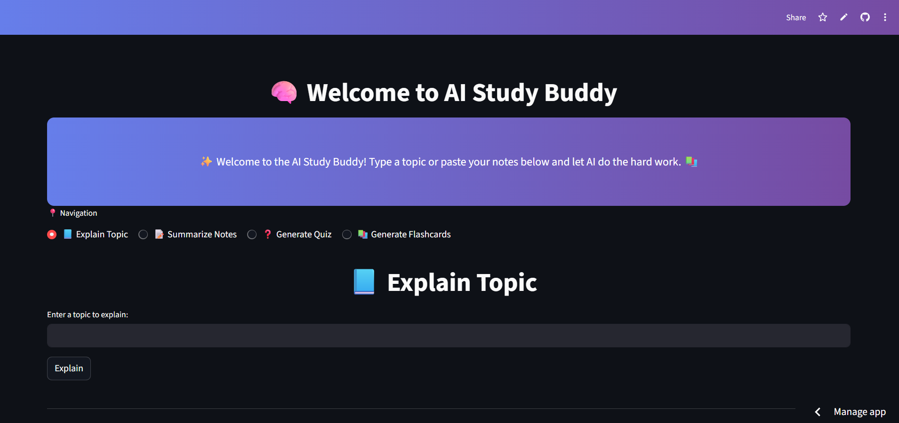
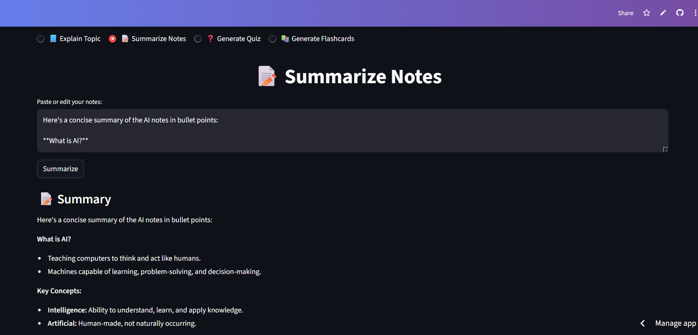
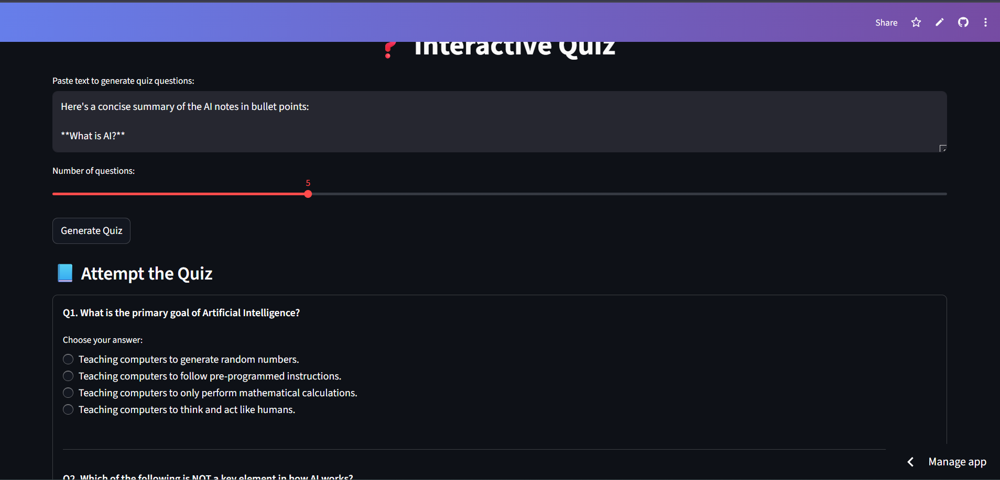

# 🧠 AI Study Buddy  
### Your Personal AI Learning Assistant — Powered by Google Gemini & Streamlit  

[](https://aistudybuddy-nwl9vb6xza4ekmz3znh8g8.streamlit.app/)
[](https://github.com/adityadorwal/AI_Study_Buddy)
[](https://www.python.org/)
[](LICENSE)

---

## 📘 Overview  

**AI Study Buddy** is an intelligent learning assistant that helps students and learners understand, summarize, and revise topics faster.  
It leverages **Google Gemini's Generative AI** to perform tasks like:
- 🧩 Explaining complex topics  
- ✂️ Summarizing long texts  
- 🧠 Generating interactive quizzes  
- 🪪 Creating flashcards for revision  

Built using **Streamlit**, it features a clean, intuitive interface that works both locally and online.  

---

## 🚀 Live Demo  
👉 **Try it now:**  
🔗 [AI Study Buddy App](https://aistudybuddy-nwl9vb6xza4ekmz3znh8g8.streamlit.app/)

---

## 🏗️ Project Structure  

```
AI_Study_Buddy/
│
├── README.md
├── requirements.txt
├── .gitignore
│
├── backend/
│   ├── __init__.py
│   └── study_tools.py       # Core AI logic using Google Gemini
│
├── frontend/
│   └── app.py               # Streamlit UI & feature integration
│
└── assets/
    ├── home.png
    ├── summary.png
    └── quiz.png
```

---

## 🧩 Features  

| Feature | Status |
|---|---|
| 📘 Explain Any Topic | ✅ Working |
| 📝 Summarize Text | ✅ Working |
| ❓ Interactive Quiz (MCQ) | ✅ Working |
| 🎴 Flashcards | ✅ Working |
| 💾 Download Results | ✅ Working |
| 🔊 Voice Input/Output | 🔜 Planned |
| 📄 PDF Export | 🔜 Planned |
| 🌐 Multi-language Support | 🔜 Planned |

---

## 🧠 Tech Stack  

| Layer | Technology |
|---|---|
| Frontend | Streamlit |
| Backend | Python 3.10+ |
| AI Model | Google Gemini 2.0 Flash (`google-generativeai`) |
| Environment | python-dotenv |
| Deployment | Streamlit Community Cloud |

---

## ⚙️ Installation  

### 1️⃣ Clone the Repository  
```bash
git clone https://github.com/adityadorwal/AI_Study_Buddy.git
cd AI_Study_Buddy
```

### 2️⃣ Create & Activate Virtual Environment

```bash
python -m venv venv
# Windows
venv\Scripts\activate
# macOS / Linux
source venv/bin/activate
```

### 3️⃣ Install Dependencies

```bash
pip install -r requirements.txt
```

### 4️⃣ Set up Environment Variable

Create a `.env` file in the project root and add:

```
GOOGLE_API_KEY=your_google_api_key_here
```

> **For Streamlit Cloud deployment:** Add `GOOGLE_API_KEY` under **Settings → Secrets** in your Streamlit dashboard instead of using a `.env` file.

### 5️⃣ Run the App

```bash
streamlit run frontend/app.py
```

---

## 🖼️ Screenshots

| Feature | Screenshot |
|---|---|
| Home Interface |  |
| Explanation Output |  |
| Quiz & Flashcards |  |

---

## 🧩 Key Python Files

### `backend/study_tools.py`

Contains core AI logic using `google.generativeai`.  
Functions:
- `explain_topic(topic)` — structured explanation with examples
- `summarize_text(text)` — concise bullet-point summary
- `generate_quiz(text, num_questions)` — MCQ generation
- `generate_flashcards(text, num_cards)` — Q&A flashcard generation

### `frontend/app.py`

Streamlit UI with 4 tabs. Imports backend functions and handles:
- Session state management (results persist across tab switches)
- Quiz parsing and one-time shuffling (correct answers never drift)
- Download buttons for all generated content

---

## 💡 Future Improvements

🔹 Add **voice input/output** support  
🔹 Enable **offline mode** (local LLM integration)  
🔹 Add **notes storage & PDF export**  
🔹 Multi-language support  

---

## 👨‍💻 Author

**Aditya Dorwal**  
📧 [18dorwaladitya@gmail.com](mailto:18dorwaladitya@gmail.com) | 🌐 [GitHub](https://github.com/adityadorwal)

---

## 🪪 License

This project is licensed under the **MIT License**.

```
MIT License

Copyright (c) 2025 Aditya Dorwal

Permission is hereby granted, free of charge, to any person obtaining a copy
of this software and associated documentation files (the "Software"), to deal
in the Software without restriction, including without limitation the rights
to use, copy, modify, merge, publish, distribute, sublicense, and/or sell
copies of the Software, and to permit persons to whom the Software is
furnished to do so, subject to the following conditions:

The above copyright notice and this permission notice shall be included in all
copies or substantial portions of the Software.

THE SOFTWARE IS PROVIDED "AS IS", WITHOUT WARRANTY OF ANY KIND, EXPRESS OR
IMPLIED, INCLUDING BUT NOT LIMITED TO THE WARRANTIES OF MERCHANTABILITY,
FITNESS FOR A PARTICULAR PURPOSE AND NONINFRINGEMENT. IN NO EVENT SHALL THE
AUTHORS OR COPYRIGHT HOLDERS BE LIABLE FOR ANY CLAIM, DAMAGES OR OTHER
LIABILITY, WHETHER IN AN ACTION OF CONTRACT, TORT OR OTHERWISE, ARISING FROM,
OUT OF OR IN CONNECTION WITH THE SOFTWARE OR THE USE OR OTHER DEALINGS IN THE
SOFTWARE.
```

---

> **Status:** 🚀 Live & Active
